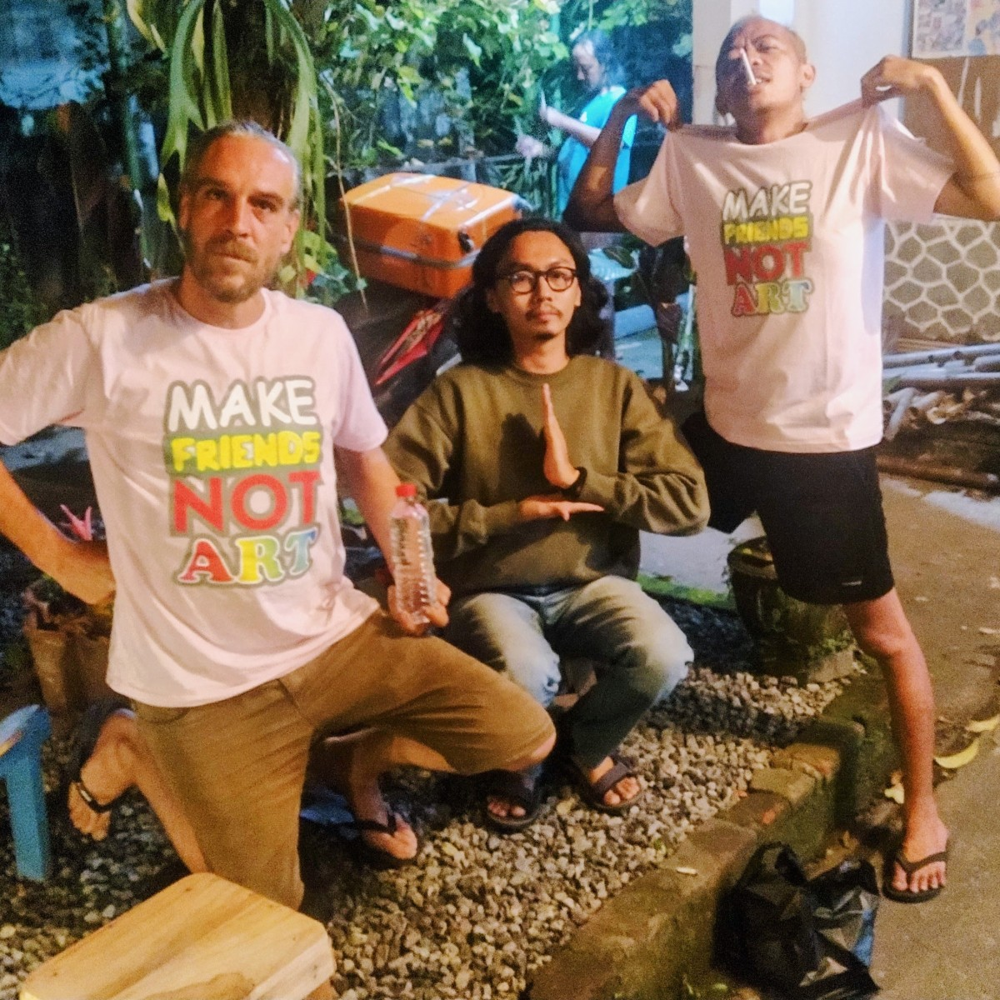
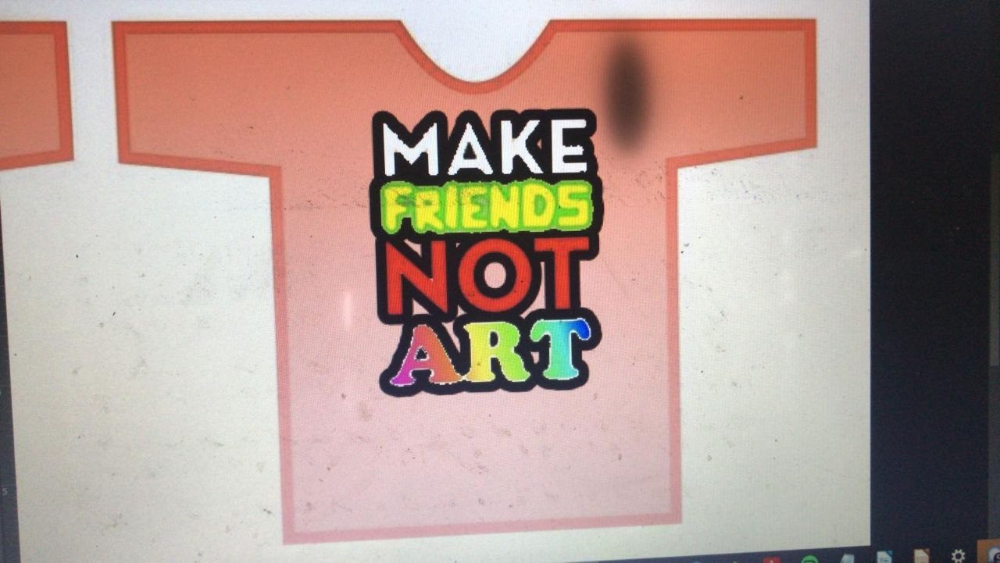
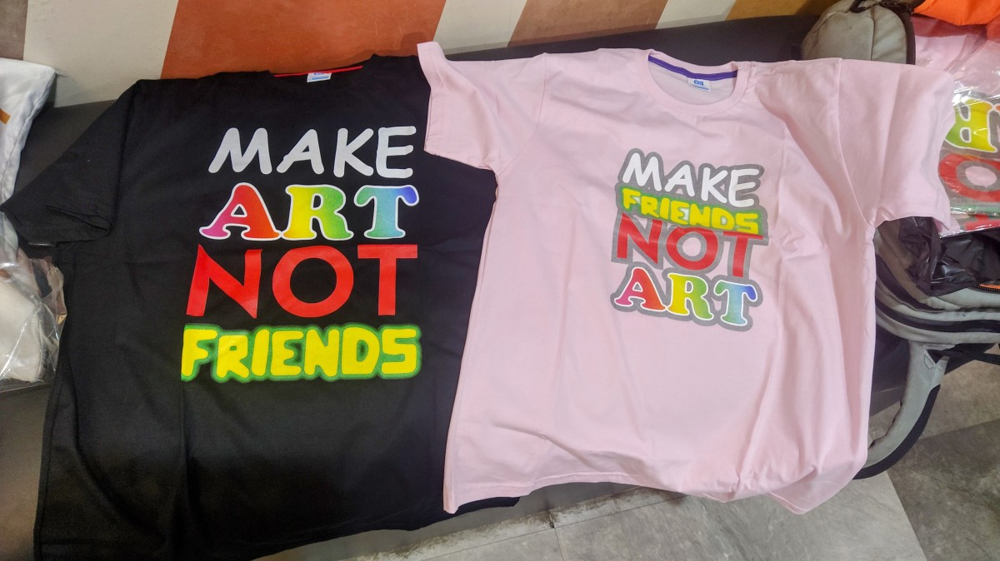
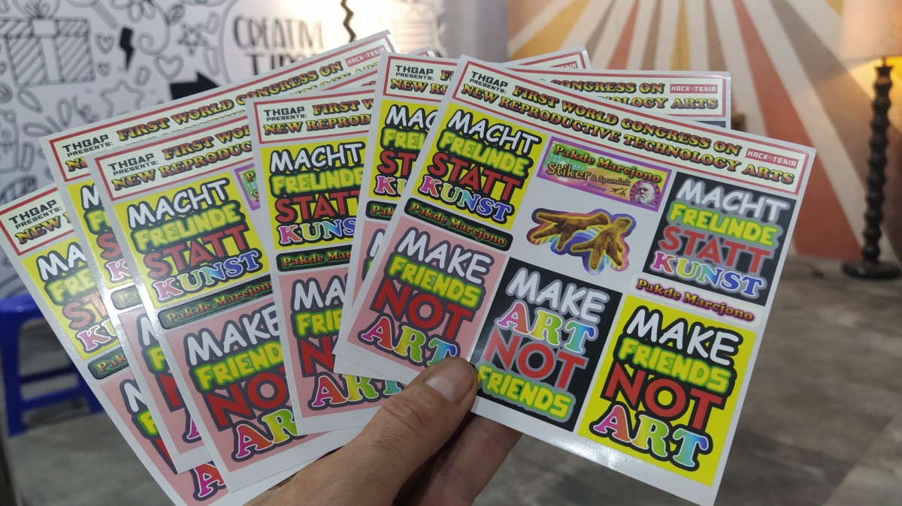

# MAKE-FRIENDS-NOT-ART
Desain stiker dan kaos

Feel free to contact dusjagr if you want to get a t-shirt printed. Or just download it and send it to whatever printshop in your neighborhood! Open Source Kaos!!

# The idea

Listening to some of the discussions and happenings at documenta fifteen and the curatorial collectives, we thought to quote them, summarizing part of the *"nongkrong"* concept as: MAKE FRIENDS NOT ART

# Jamming with online friends

Having some online discussions with friends, we came up with making a design for a t-shirt, thx to Miranda M. for helping with the design.

# The t-shirt (kaos)

Due to different cultures and oppinions we also customized modified versions of the slogan for the t-shirt: MAKE ART NOT FRIENDS

# The stickers (stiker)

For our German friends we also made translated versions of the sticker: MACHT FREUNDE STATT KUNST

